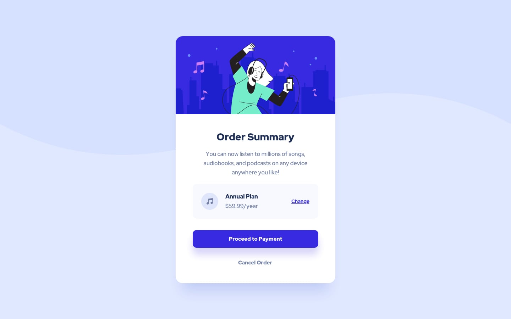

# Título de nível 1

Lorem ipsum dolor sit amet, consectetur adipiscing elit. Mauris a turpis id sapien finibus ultricies. Vivamus in quam nisl. Nullam volutpat magna at nibh ornare laoreet. Phasellus ultricies arcu in tellus porttitor sodales. Quisque porttitor pretium sagittis. Cras ut lacinia purus. Suspendisse tincidunt ac dolor non aliquam. Sed faucibus condimentum mollis. Donec consectetur erat et augue tristique, at fermentum nisi blandit. Morbi et gravida eros. Vivamus ornare varius enim in sodales. Praesent congue lacus est, at pharetra eros faucibus ac. Cras auctor orci ligula, a iaculis orci blandit nec. Phasellus placerat velit ut augue sollicitudin laoreet. Quisque nisl felis, aliquet eu tellus vel, elementum aliquam mi. Pellentesque habitant morbi tristique senectus et netus et malesuada fames ac turpis egestas.

## Nível 2 de título

### Lista - nível de título 3

-   item 1
-   item 2
-   item 3
    -   item 3.1
    -   item 3.2
        -item 3.3
-   item 4
    -   item 4.1
    -   item 4.2

```html
<h1>Título do html para teste</h1>
```

```js
function pegarArquivo(caminho) {
    console.log(caminho);
}
```

## Adicionando imagem



**Atenção: O arquivo em questão não é para produção. É apenas um arquivo de teste para o readme.md".**
